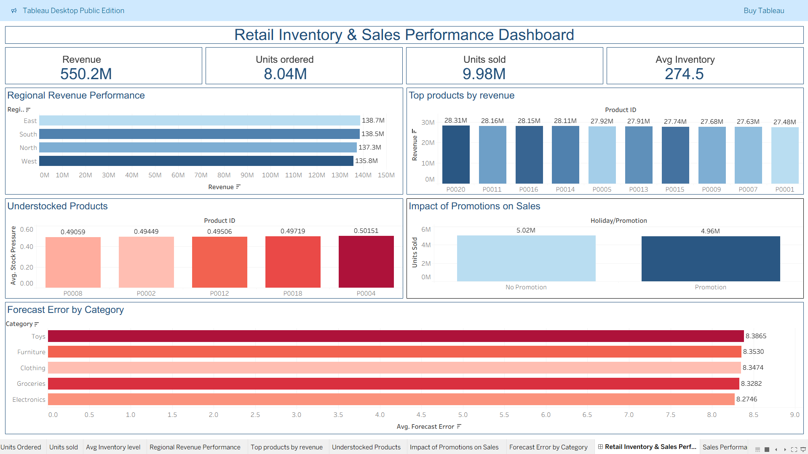

# Retail Inventory & Sales Performance Dashboard

## Overview

Analyzed retail inventory and sales data using MySQL and developed an interactive Tableau dashboard to evaluate revenue performance, inventory optimization, demand forecasting accuracy, and promotion effectiveness.

The project focuses on identifying top-performing products, inventory risks, forecasting errors, and the impact of promotional campaigns on sales performance.

## Tools

* MySQL
* Tableau Public
* Microsoft Excel

## Live Dashboard

🔗 Tableau Public Dashboard: [View Dashboard](https://public.tableau.com/app/profile/ashwin.r4543/viz/RetailinventorySalesPerformanceDashboard/RetailInventorySalesPerformanceDashboard)

## Dataset

* Retail Store Inventory Dataset
* 10,000 Records (Approx.)

## SQL Analysis

Performed business analysis using SQL, including:

* Revenue by Region
* Sales by Category
* Top Products by Revenue
* Store Performance Analysis
* Understocked Products Identification
* Overstocked Products Analysis
* Forecast Accuracy Evaluation
* Forecast Error Analysis
* Promotion Impact on Sales

## Dashboard Features

### KPIs

* Total Revenue
* Total Units Sold
* Average Inventory Level
* Forecast Accuracy

### Visualizations

* Regional Revenue Performance
* Top 10 Products by Revenue
* Products Requiring Restocking
* Forecast Error by Category
* Promotion Impact on Sales

### Filters

* Region
* Category

## Key Insights

* Identified regions contributing the highest revenue.
* Highlighted top-performing products based on revenue.
* Detected products requiring immediate restocking.
* Evaluated forecasting performance across product categories.
* Measured the effectiveness of promotional activities on sales.
* Provided actionable insights for inventory optimization and demand planning.

## Dashboard Preview

## Project Structure

Retail-Inventory-Sales-Dashboard/

├── Dataset/

├── SQL/

├── Dashboard/

│   ├── Dashboard.png

│   └── tableau_public_link.txt

└── README.md

## Author

Ashwin
